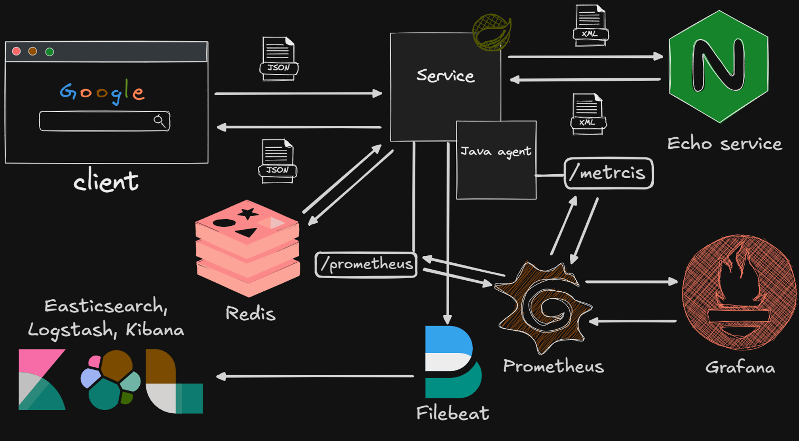

# Цепочка сервисов
Client может выступать любым (браузер, другой сервис), например я пользовался postman для отправки запросов. 
Echo service отвечает сервису тем же XML что отправляет Service. Он примитивный, но на его место может встать TranzAxis.
## Service endpoints:
### POST /process
Клиент отправляет JSON (любой). Service перекладывает JSON в XML и отправляет в Echo service, затем Service генерирует UUID, случайное число и сохраняет в Redis. В ответе клиенту добавляем UUID, который сгенерировали. JSON схема ответа может модифицироваться без перекомпиляции приложения, поэтому можно вместо Echo service поставить TranzAxis и подправить схему, например, чтобы положить в ответ те поля, которые отправляет TX в ответе. Схемы хранятся в /resources/schemas.
### GET /process/{UUID}
Клиент отправляет запрос с UUID, который он получил при запросе POST /process. Service делает запрос к Redis, чтобы получить разметку с числом, которое мы сгенерировали ранее. 
# Javaagent
К Service подключен Java agent, который замеряет время выполнения методов и открывает порт для сбора метрик в формате prometheus. Jar агента запускается вместе с jar основного приложения через флаг -javaagent. Также после указания пути до jar агента через = нужно указать корневую директорию проекта (изначально полное название метода очень большое, и чтобы в Grafana методы названия были короче мы берём название метода после корневой директории), затем через запятую те директории которые нужно будет сканировать агенту для замера времени выполнения методов классов в этих директориях.
## Пример команды для запуска приложения с агентом
java -javaagent:{Путь до jar агента}\timing-agent-1.0-SNAPSHOT.jar=app.project_profile,app.project_profile.api. -jar {Путь до jar основного приложения}\service-0.0.1-SNAPSHOT.jar