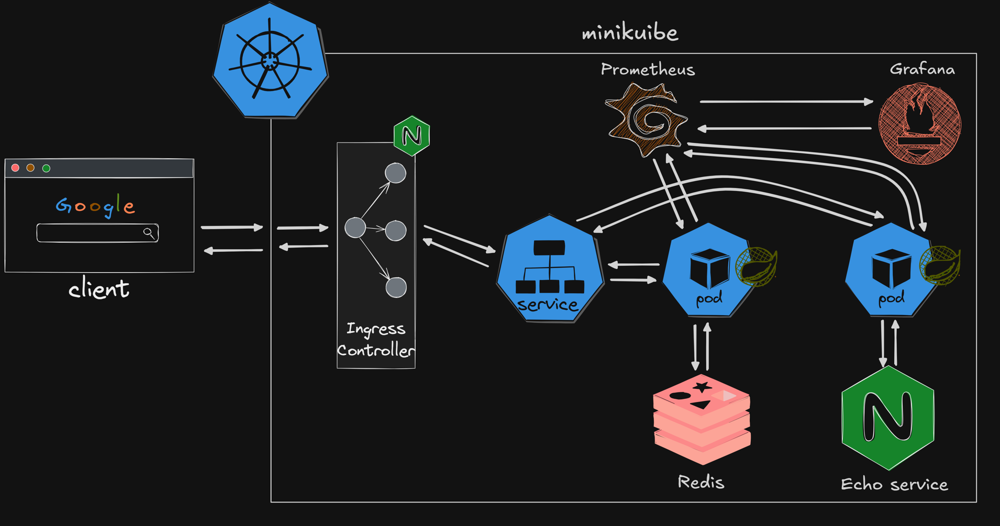

## В проекте я постарался прокомментировать все основные конфигурационные файлы проекта.
# Описание проекта
Учебный проект, демонстрирующий построение наблюдаемости Spring Boot сервиса. Включает:
- Сбор JVM/HTTP-метрик через Actuator
- собственный Java-агент на Byte Buddy для замера времени работы методов
- централизованное логирование через ELK-стек (Logback → Filebeat → Logstash → Elasticsearch → Kibana)
- Визуализацию метрик в Grafana, логов в Kibana. 
- Деплой инфраструктуры в Kubernetes
# Информация о Client и Echo Service

В роли **Client** может выступать любое приложение (браузер, другой сервис и т.д.). Например, для отправки запросов я использовал **Postman**.

**Echo Service** отвечает сервису тем же XML, который получил в запросе, дополнительно добавляя несколько кастомных полей (подробнее см. в файле `/nginx/echo.js`).

Echo Service реализован максимально просто, однако на его место можно поставить **TranzAxis** без изменения общей архитектуры приложения.

## Service endpoints

### POST /process

Клиент отправляет JSON (структура может быть любой).

Далее Service:

1. преобразует JSON в XML;
2. отправляет XML в Echo Service по HTTP;
3. получает ответ в формате XML;
4. преобразует XML обратно в JSON;
5. генерирует UUID и случайное число;
6. сохраняет эти данные в Redis;
7. добавляет сгенерированный UUID в ответ клиенту. (в k8s отправляется ещё POD_NAME)

Схема JSON-ответа может изменяться **без перекомпиляции приложения**. Благодаря этому вместо Echo Service можно подключить TranzAxis и изменить JSON-схему таким образом, чтобы в ответ автоматически попадали поля, возвращаемые TranzAxis.

На данный момент Echo Service добавляет собственные поля. Они также описаны в JSON-схеме, чтобы при преобразовании XML в JSON автоматически попадали в ответ.

Все схемы находятся в директории основного приложения `/resources/schemas`.

### GET /process/{UUID}

Клиент отправляет UUID, который был получен при выполнении запроса **POST /process**.

Service обращается к Redis и получает ранее сохранённые данные, связанные с данным UUID (в том числе случайное число, сгенерированное при обработке POST-запроса).

# Java Agent

К Service подключён **Java Agent**, который:

- измеряет время выполнения методов;
- публикует метрики в формате Prometheus на отдельном HTTP-порту.

> **Важно!**
> Агент не измеряет время выполнения методов классов Spring Boot. Он инструментирует только методы бизнес-логики, расположенные в пакетах, указанных при запуске агента.

JAR-файл агента (**shadowJar**) запускается одновременно с JAR-файлом основного приложения через параметр **`-javaagent`**.

После пути к JAR-файлу агента через символ `=` необходимо указать:

1. корневой пакет проекта;
2. через запятую — пакеты, методы которых необходимо инструментировать.

Корневой пакет используется для сокращения отображаемых названий методов. Полные имена методов могут быть очень длинными, поэтому в Grafana отображается только часть имени, следующая за указанным корневым пакетом.

Для сборки агента используется плагин **Shadow**, который создаёт **fat JAR**, содержащий не только код агента, но и все его зависимости (например, **Byte Buddy**). Благодаря этому агент можно подключить через параметр `-javaagent` без необходимости отдельно добавлять его библиотеки в `classpath`.

В проекте формируются два JAR-файла:

- **bootJar** — Spring Boot приложение.
- **shadowJar** — Java Agent.

## Пример запуска приложения с агентом

```bash
java -javaagent:{Путь до jar агента}\timing-agent-1.0-SNAPSHOT.jar=app.project_profile,app.project_profile.api -jar {Путь до jar основного приложения}\service-0.0.1-SNAPSHOT.jar
```
# Echo service
В директории `nginx` находятся файлы конфигурации Echo service:
- `Dockerfile` - образ NGINX с необходимой конфигурацией
- `echo.js` - файл который определяет как мы будем отвечать на запросы.
- `nginx.conf` - конфигурация Nginx.
`Dockerfile`, `echo.js`, `nginx.conf` для запуска сервиса
# Prometheus
В директории `config` находится файл `prometheus.yml`, содержащий конфигурацию Prometheus.  
В файле определены `scrape_configs` для сбора метрик.
# Grafana
В директории `config/grafana` находятся файлы конфигурации Grafana:
- `Dockerfile` — образ Grafana с необходимой конфигурацией.
- `dashboards` — автоматически импортируемые дашборды при запуске Grafana.
- `datasources` — автоматически настраиваемые источники данных (Prometheus) при запуске Grafana.
В Grafana по умолчанию при запуске добавиться 3 дашборда и prometheus.
# Filebeat
В директории `filebeat` описан `filebeat.yml` для конфигурации filebeat.
# Logstash
В директории `logstash/pipeline` описан `logstash.conf` для получения, обработки и отправки логов в elasticsearch.
# Docker Compose

Вся инфраструктура описана в `docker-compose.yml`, поэтому её можно полностью развернуть в Docker-контейнерах.

Перед запуском `docker-compose` необходимо сгенерировать два JAR-файла:

- **bootJar** — Spring Boot приложение.
- **shadowJar** — Java Agent.

В `Dockerfile` основного приложения по умолчанию указаны `SCANNING_PACKAGES`, однако при необходимости этот параметр можно переопределить в `docker-compose.yml`.

# Нагрузочное тестирование

Для создания нагрузки на сервис и последующего анализа метрик использовалась консольная утилита **k6**.

В директории `scripts` находится файл `stress.js`, в котором описан сценарий нагрузочного тестирования.

Запустить тест можно командой:

```bash
k6 run stress.js
```

# Отличие настроек docker среды и k8s

`config/grafana/datasources/all.yml` — файл автоматической настройки источников данных Grafana. В большинстве случаев изменять его не требуется. Однако если Prometheus в Kubernetes будет развернут с другими именем Service или адресом, необходимо изменить URL подключения к Prometheus.

> **Важно!**
> В Kubernetes не разворачиваются **ELK** и **Filebeat**, поскольку эта часть инфраструктуры потребляет достаточно много ресурсов. На моей машине недостаточно ресурсов, чтобы одновременно развернуть и протестировать всю инфраструктуру.


# Kubernetes



Для запуска приложения в Kubernetes необходимо применить все манифесты, расположенные в директории `k8s`.

# Локальное тестирование Kubernetes-кластера

## 1. Добавить доменное имя в hosts

Узнайте IP-адрес Ingress:

```bash
kubectl get ingress
```

Добавьте запись в файл:

- **Windows:** `C:\Windows\System32\drivers\etc\hosts`
- **Linux:** `/etc/hosts`

Например:

```text
192.168.49.2 profile.local
```

---

## 2. Настроить Service для внешнего доступа

Если приложение должно быть доступно извне кластера, измените тип Service на `LoadBalancer`.

Например:

```yaml
spec:
  type: LoadBalancer
```

После изменения примените манифест:

```bash
kubectl apply -f service.yaml
```

---

## 3. Запустить Minikube Tunnel

Для работы `LoadBalancer` в Minikube необходимо запустить туннель:

```bash
minikube tunnel
```

---

## 4. Проверить доступность приложения

Приложение будет доступно по адресу:

```text
http://profile.local
```

Например:

```text
http://profile.local/api/process
```

---

## 5. Пробросить порт (при необходимости)

Если необходимо получить доступ к Pod или Service локально (например, к Grafana или Prometheus), можно воспользоваться `port-forward`.

Примеры:

```bash
kubectl port-forward svc/grafana 3000:3000
```

```bash
kubectl port-forward svc/prometheus 9090:9090
```

После этого сервис будет доступен по адресу:

```text
http://localhost:<порт>
```

Например:

```text
http://localhost:3000
```

---
